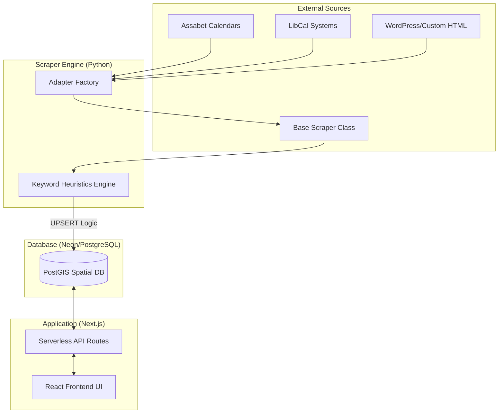

# Librova
## Library event aggregator app

### 1. Overview

**Librova uses automated event aggregation to make it easy for patrons to discover library events nearby.**

## The Problem

Finding out what's happening at your local library shouldn't require a research project — but right now, it can. Event information is scattered across individual library websites, Facebook pages, local community calendars, and physical bulletin boards. If you want to know whether there's a storytime or a job skills workshop happening today at a library near you, you might need to check five different websites with five different interfaces. Most people won't bother.

This fragmentation also hurts libraries, not just patrons. Staff at small and mid-size libraries — already stretched thin and wearing too many hats — are expected to manually cross-post events to every platform where patrons might be looking. It's unsustainable busywork that pulls time away from the work that actually matters.

## The Solution

Librova uses automated library calendar adapters to pull event data from disparate library calendar systems, normalize it, and display it in a single, filterable web app. Users can search by event type, date, and location. For libraries, this is a zero-friction solution: they've already done the work of putting events on their own calendars. Librova pulls from that source of truth once daily and keeps events in sync, so the data is as accurate and up-to-date as the calendars it draws from.

### 2. The Technical Stack 

**Frontend:** Next.js, Tailwind CSS
**Backend/API:** Next.js Serverless Functions
**Scraping Engine:** Python (runs via GitHub Actions cron; posts to database through Next.js API routes)
**Database:** PostgreSQL with PostGIS for spatial queries, hosted on Neon
**Automation:** GitHub Actions cron job triggers daily calendar sync
**CI/CD & Deployment:** GitHub → Vercel (automatic deploys on push to main)

(Condense this)This project was developed using a "Human-in-the-loop" AI orchestration model. While AI (specifically Gemini and LLM-assisted coding) was used to accelerate the generation of boilerplate and initial adapter logic, all architectural decisions, database schema design (PostGIS), and edge-case resolution (such as complex HTML hierarchy bugs) were manually architected and audited. This approach allowed for rapid prototyping while maintaining high standards for data integrity and system security.

### 3. Architecture & Data Flow

**The Adapter Factory:** Explain the modular Python system. How a BaseScraper class allows for quick deployment of new library systems (Assabet, LibCal, etc.).
**Spatial Logic:** Mention how you use ST_DWithin to calculate real-time distance from user coordinates.
**Categorization Engine:** Describe the heuristic keyword-mapping system that automatically tags events for the UI.


### 4. Local Development/Quickstart

#### Prerequisites

- Node.js (v18+) 
- Python (3.9+) 
- A PostgreSQL database (Local, or a free cloud tier like Neon or Supabase)

#### Clone & Install

```bash
# Clone the repo
git clone https://github.com/veronica-stork/librova-new

# Install Node dependencies
cd librova
npm install

# Install Python dependencies
cd ../scraper
python -m venv venv
source venv/bin/activate 
pip install -r requirements.txt
```

#### Database Setup
To set up your database, do the following:
1. Create a PostgreSQL database.
2. Run the provided `database/schema.sql` file to create the `events`, `libraries`, and `categories` tables.
3. Insert seed data:
```sql
INSERT INTO libraries (name, scraper_config) 
VALUES ('Red Hook Public Library', '{"platform": "assabet", "base_url": "https://redhooklibrary.assabetinteractive.com/calendar"}');
```

#### Environment Variables
Duplicate the `env.example` file and rename it to `env.local`. Fill in the following keys:
- `DATABASE_URL`
- `SCRAPER_API_KEY`
- [SOMETHING ELSE HERE]

#### Spin it up!
1. Start the Next.js server:
```bash
npm run dev
```
2. Open a second terminal window, ensure the Python virtual environment (venv) is activated, and run the scraper:
```bash
python main.py
```
3. Navigate to `localhost:3000` to see your app

### 6. Roadmap 

- Search & Discovery: Zip code geocoding and radius sliders.
- Operational Scalability: Moving keywords to the database.
- Monetization: Community Partner tiers and "Featured" placements.

### 7. Local Impact 
(The "Why")Mention the Mid-Hudson Library System specifically.Highlight the goal of supporting the 66 libraries across Dutchess, Ulster, Columbia, Greene, and Putnam counties.