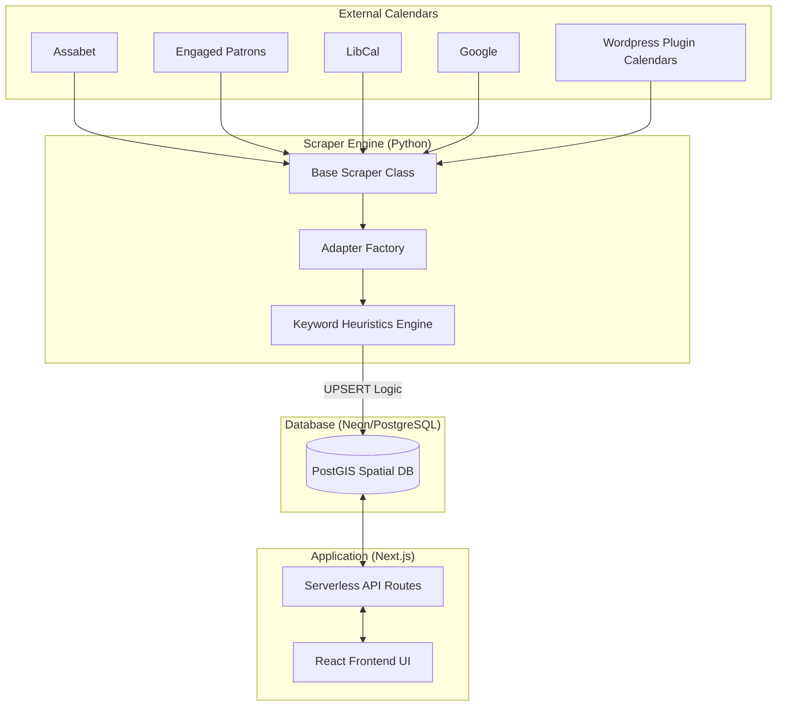

# Librova
## Library event aggregator app

### 1. Overview

**Librova uses automated event aggregation to make it easy for patrons to discover library events nearby.**

## The Problem

Finding out what's happening at your local library shouldn't require a research project — but right now, it can. Event information is scattered across individual library websites, Facebook pages, local community calendars, and physical bulletin boards. If you want to know whether there's a storytime or a job skills workshop happening today at a library near you, you might need to check five different websites with five different interfaces. Most people won't bother.

This fragmentation also hurts libraries, not just patrons. Staff at small and mid-size libraries — already stretched thin and wearing too many hats — are expected to manually cross-post events to every platform where patrons might be looking. It's unsustainable busywork that pulls time away from the work that actually matters.

## The Solution

Librova uses automated library calendar adapters to pull event data from disparate library calendar systems, normalize it, and display it in a single, filterable web app. Users can search by event type, date, and location. For libraries, this is a zero-friction solution: they've already done the work of putting events on their own calendars. Librova pulls from that source of truth once daily and keeps events in sync, so the data is as accurate and up-to-date as the calendars it draws from.

### 2. The Technical Stack 

**Frontend:** Next.js, Tailwind CSS    
**Backend/API:** Next.js Serverless Functions  
**Scraping Engine:** Python (runs via GitHub Actions cron; posts to database through Next.js API routes)  
**Database:** PostgreSQL with PostGIS for spatial queries, hosted on Neon  
**Automation:** GitHub Actions cron job triggers daily calendar sync  
**CI/CD & Deployment:** GitHub → Vercel (automatic deploys on push to main)  
**Development Approach:** Human-in-the-loop AI-assisted development (Gemini). Architecture, schema design, and edge-case debugging are manual; AI accelerated boilerplate and initial adapter scaffolding.


### 3. Architecture & Data Flow

**⚙️ The Adapter Factory**  
Librova utilizes a modular, object-oriented Python architecture designed for rapid deployment of new library system scrapers.
- **BaseScraper Class**: The foundation of the system. It defines the standardized interface (e.g., `fetch_events()`, `parse_page()`, `format_output()`) that all library-specific scrapers must implement.
- **Quick Deployment**: By inheriting from the BaseScraper, adding a new library source requires only defining the specific selectors and endpoint logic for that system (Assabet, LibCal, etc.).
- **Decoupled Maintenance**: Because each adapter is self-contained, a change in one library's website structure does not impact the stability of the others, allowing for isolated troubleshooting and "surgical" updates rather than system-wide refactoring.

**📍 Spatial Logic**  
To respect geographic boundaries and ensure users only see relevant events, Librova uses PostgreSQL’s PostGIS capabilities.  
- **Proximity Filtering**: We use the `ST_DWithin` function in our SQL queries to calculate real-time distance between the library’s stored location (a PostGIS geography(Point) type) and the user's coordinates.
- **Efficiency**: This approach allows the database to perform spatial joins natively, ensuring that "local" results are returned with minimal latency and without the overhead of client-side distance calculations.

**🏷️ Categorization Engine**  
Librova’s categorization engine is designed to maximize searchability and UI organization while keeping manual intervention to a minimum.
- **Heuristic Keyword Mapping**: When a new event is ingested, the engine runs a heuristic mapping against a predefined categories table. It scans titles and descriptions for specific triggers to assign category IDs and primary categories.
- **Human-in-the-Loop**: Automation handles the "first pass," but the system is engineered for perfection via the `is_locked_by_staff` and `human_verified` flags. Once an admin performs a manual correction in the dashboard, the system marks the record as "verified," effectively pinning manual classifications and shielding them from being overwritten by future automated scraper runs. *(Currently under construction)*


```mermaid
graph TD
    subgraph "External Calendars"
        A[Assabet]
        B[Engaged Patrons]
        C[LibCal]
        D[Google]
        E[Wordpress Plugin Calendars]
    end

    subgraph "Scraper Engine (Python)"
        F[Base Scraper Class]
        G[Adapter Factory]
        H[Keyword Heuristics Engine]
    end

    subgraph "Database (Neon/PostgreSQL)"
        I[(PostGIS Spatial DB)]
    end

    subgraph "Application (Next.js)"
        J[Serverless API Routes]
        K[React Frontend UI]
    end

    A & B & C & D & E --> F
    F --> G
    G --> H
    H -- "UPSERT Logic" --> I
    I <--> J
    J <--> K
```
### 4. Local Development/Quickstart

#### Prerequisites

- Node.js (v18+) 
- Python (3.9+) 
- A PostgreSQL database (Local, or a free cloud tier like Neon or Supabase)

#### Clone & Install

```bash
# Clone the repo
git clone https://github.com/veronica-stork/librova-new

# Install Node dependencies
cd librova
npm install

# Install Python dependencies
cd ../scraper
python -m venv venv
source venv/bin/activate 
pip install -r requirements.txt
```

#### Database Setup
To set up your database, do the following:
1. Create a PostgreSQL database.
2. Run the provided `database/schema.sql` file to create the `events`, `libraries`, and `categories` tables.
3. Insert seed data (either your own, or the samples included in `database/schema.sql`)

#### Environment Variables
Duplicate the `env.example` file and rename it to `env.local`. Fill in the following keys:
- `DATABASE_URL`
- `SCRAPER_API_KEY`: To interact with your own API. You create this.
- `VERCEL_OIDC_TOKEN`: If you are deploying to Vercel
- `GOOGLE_API_KEY`: If you are pulling events from any Google calendars, you will need an API key. If you do not have a Google API key yet, [learn how to get one here](https://developers.google.com/workspace/guides/get-started).

#### Spin it up!
1. Start the Next.js server:
```bash
npm run dev
```
2. Open a second terminal window, ensure the Python virtual environment (venv) is activated using `source venv/bin/activate`, and run the scraper:

```bash
python main.py
```

3. Navigate to `localhost:3000` to see your app
