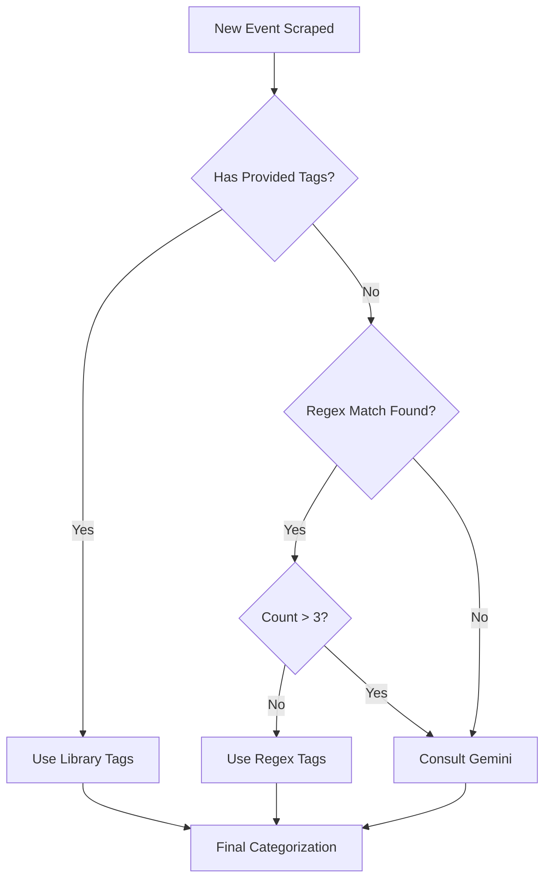

# Notes on Categorization Refinement

**March 4, 2026** 
- `LGBTQ` events are being tagged as `special needs` if they use the word `inclusive`. I will probably remove `inclusive` from the `special needs` category, as that will likely never be included in a description/title without other qualifying phrases such as `special needs` and `all abilities`.
- A `craft` event was correctly classified as `crafts`, but also `money`. It took me a bit to figure out why, but it was because the description mentioning people sharing their "wealth of knowledge" with other crafters. I will add a condition that prevents `money` from being triggered if the term "wealth" is followed by "...of knowledge."
- I am seeing a number of board and committee meetings showing up. Obviously board meetings are open to the public, but I don't think a user looking for something to do is going to want to attend a board meeting randomly. I will add `board meeting` to the bounced terms. I am torn on adding `committee` as that could also be used in the context of a teen advisory committee. 
- Found another variation of the word "Mah Jongg" (I think we're at 3 different ones now.) Must add `Mah-Jongg` to `games`. 
- I need to create more robust separation of `STEM` events and `tech help` events. There is an obvious difference in the audiences and goals of, for example, a program on how to access your email on your phone and one on how to create a game in Python. I am going to make sure the `tech help` category includes the terms `tech help`, `technology help`, and `technology questions`, and that it "consumes" the `STEM` category.
- I need to limit the number of categories displayed to 2 or 3 as they are overtaking the card in some cases. This will require ranking them in terms of importance, which is another challenge, then displaying only the top categories. - **STILL TO DO**

**March 5, 2026**

- Terms to add to `games`: `Canasta`
- The new "My Calendar" calendars are picking up categories in the titles, e.g. *Category: GeneralWinter Storytime*. Sometimes, categories *and* times, e.g. *Category: General3:00 pm–5:00 pmWeekly Wellness Day with Mountain Top Cares Coalition*. I need to figure out why. 
- Some events show as having no link when they do actually have a link. I need to figure out why. It doesn't necessarily seem to be tied to particular calendars or libraries - for example, today I see two events from Pawling - one with a link and one without.
- "French Conversation Class" was not picked up as being a foreign language program, probably because I removed the word "french" from the category. I did this because a lecture on French history was getting flagged as a language program. I will add "French conversation," "spanish conversation," etc. to the category.

**March 6, 2026**

- I am exploring the possibility of using a small language model to assist in categorization. The flow will be as follows:

My logic is this:

1. If a library has provided tags, we will use those. These are almost guaranteed to be accurate (unless it is a default "General" category tag.)
2. If they haven't, the event goes to the Regex-based category matcher. If it finds categories using that tool, and there are fewer than 4 (meaning it won't overcrowd the UI), it will use those categories. 
3. If the regex matcher finds more than 3 categories OR if it doesn't find any, a small language model (Gemini 3 Flash) is consulted. It will find the 3 most relevant categories. 

This waterfall method ensures that every event gets at least one category, but only resorts to using AI when more efficient means have come up short.